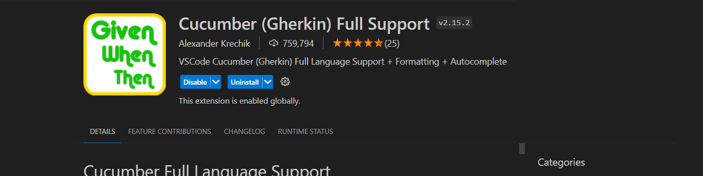
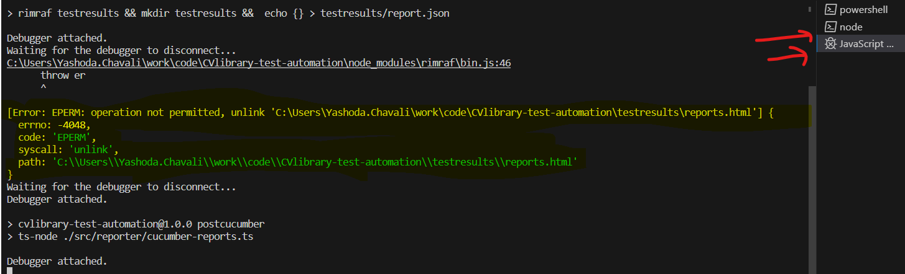

# CVLibrary Test Automation Technical Task

Test framework is built by using Cucumber Typescript Playwright libraries. 

## Table Of Contents
- Installation
- Features
- Usage
- Results
- Contribution
- References

### Installation

1. Clone the repository: `git clone https://github.com/`
2. Navigate to the project directory: `cd CVlibrary test automation`
3. Install VS Code/ any code editor as IDE `https://code.visualstudio.com/download`
4. Install cucumber full support extension 
 
5. Install dependencies: `npm install`

### Features

- Feature 1: Validation of search functionality
- Scenario: Validation of search functionality with valid inputs 
     This Scenario is validation of search functionality with possible inputs and parametarised tests.  
- Scenario: Validation Salary inputs validation for negative test scenario
     This Scenario is validation of search functionality for negative testing.  

### Usage

After installing dependencies, todo tasks for running the tests in local machine

1. Open Terminal in VSCode 
2. `npm run test` command to run tests 
3. 
4. Close all terminals and try to open new terminal 
5. If Before All or After All error occurs try to run tests again it will work

### Results
 ./readmescreenshots/technicaltask.mp4

### Contribution

 Contributions are recommonded if any....

### References

 Cucucmber- `https://cucumber.io/docs/cucumber/`
 Playwright- `https://playwright.dev/docs/intro`
 Typescript- `https://www.typescriptlang.org/docs/handbook`

